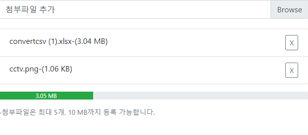

## 정의
vue-file-input is a vue-component that displays a list of attachments. Please note that vue2 and bootstrap4 have dependencies.
 - Return the attachment data as an array
 - File size and number of files can be limited
 - English and Korean support





## Getting Started
```shell
npm install vue-file-input
```

### Usage
#### Example
```html
<template>
  <vueFileInput
    :fileCount = 5
    :filelimitSizeByte = 10485760
    @getFileInfoArray = "fromFileInfoArray"
    :horizontal = true
    :language = 'ko'
  ></vueFileInput>
</template>

<script>
import vueFileInput from 'vue-file-input'
import  'vue-file-input/dist/vue-file-input.esm.css' //bootstrap4

export default {
  name: 'App',
  components: { vueFileInput },
  data () {
        return {
            fileInfo:[],
        }
    },
  methods:
  {
    fromFileInfoArray(array)
    {
        this.fileInfo = [...array];
    },
  }
}
</script>
```
----

#### Properties
| Property name | Type      | Default   | Required |Description                                                                                         |
| ------------- | --------- | --------- | -------- | -------------------------------------------------------------------------------------------------- |
| fileCount          | `Number`  | `5`         | ❌         |limit number of files|
| filelimitSizeByte         | `Number`  | `10485760`         | ❌        | Limiting file size (kb)|
| horizontal   | `Boolean`  | `false` | ❌        | Setting to display the file list horizontally and vertically |
| getFileInfoArray     | `function` | ❌   | ✅       | Function that returns attachment data as an array|
| language     | `string` | `en`   | ❌      | English and Korean support|

----
### License
MIT